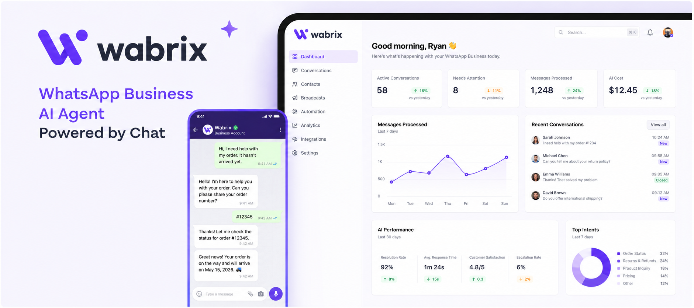
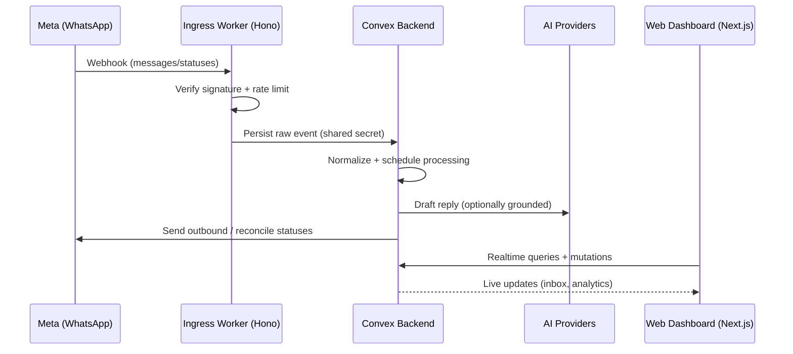

# Wabrix

<p align="left">
   
   
   
   
   
</p>

<p align="left">
   
   
   
</p>



Wabrix is a WhatsApp-first AI customer communication platform that combines an automated, knowledge-grounded bot with a real-time operator inbox.

Wabrix helps teams handle more WhatsApp conversations without losing quality.

- Reduce response time with AI-drafted replies grounded in your business knowledge.
- Keep full control with human handoff, assignments, internal notes, and delivery visibility.
- Stay compliant with WhatsApp rules (service window, templates, opt-in/opt-out behavior).

## What Wabrix is

Wabrix is a multi-tenant SaaS for businesses that run support and sales on WhatsApp:

- **Bot Studio** to configure bot behavior (instructions, language, safety/guardrails) per organization.
- **Knowledge Base** to ingest inline text, websites, and files, then retrieve relevant chunks at reply time.
- **Inbox** for operators: conversation list + thread view + actions (assign, pause/resume bot, handoff, manual replies, template sends).
- **Billing & usage**: subscription state plus metered usage signals (AI and messaging activity) surfaced in the dashboard.

## How it works (system flow)

1. **Connect WhatsApp Business**
   - You configure your Meta webhook to point to Wabrix ingress.
2. **Edge ingestion (fast + durable)**
   - A Cloudflare Worker verifies Meta signatures, rate-limits per phone number, and persists raw webhook events immediately.
3. **Normalization + processing (Convex)**
   - Stored events are normalized into tenant-scoped entities (contacts, conversations, messages, delivery statuses).
   - Media events can enqueue download/processing work.
4. **Bot orchestration (human-in-the-loop)**
   - New inbound messages schedule bot work with debounce, service-window checks, and usage gating.
   - If eligible, the bot drafts a reply (optionally grounded via Knowledge Base retrieval).
5. **Outbound delivery + reconciliation**
   - Outbound sends are tracked with idempotency, retries, and delivery state updates from status webhooks.
6. **Operator workspace**
   - The dashboard (Next.js) stays in sync in real-time via Convex queries/mutations for a “live inbox” experience.



## What makes it different

- **Edge-first webhook reliability**: signature verification + rate limiting + durable event storage before acknowledgement.
- **Grounded responses, not generic chat**: knowledge ingestion → chunking → embeddings → retrieval at generation time.
- **Built for operations**: assignments, handoff, bot pause/resume, internal notes, delivery states, and service-window visibility.
- **Multi-tenant by design**: organization scoping, RBAC, and audit-friendly workflows.

## Tech stack

- **Frontend**: Next.js (App Router), React, TypeScript, Tailwind CSS, Radix UI/shadcn-style primitives, `next-intl` (i18n), `next-themes`.
- **Auth**: Clerk (with webhook-driven user/org sync).
- **Backend**: Convex (database, real-time queries, server functions, scheduling/queues, file storage).
- **Ingress**: Cloudflare Workers + Hono + Wrangler.
- **AI**: Vercel AI SDK + provider SDKs (Google Gemini and OpenAI adapters in backend).
- **Payments**: Polar + Midtrans (webhook forwarding into Convex).
- **Testing**: Vitest (and Playwright where applicable).
- **Monorepo tooling**: pnpm workspaces + Turborepo.

## Repository layout

- `apps/web`: Next.js dashboard (Bot Studio, Inbox, Knowledge Base, Billing, Analytics).
- `apps/ingress`: Cloudflare Worker for Meta webhooks and event durability.
- `packages/backend`: Convex functions (auth sync, WhatsApp processing, orchestration, knowledge ingestion, outbound delivery, billing).
- `packages/ui`: shared UI components.
- `packages/config`: shared configuration and constants.

## Local development

### Prerequisites

- Node.js `>= 22`
- `pnpm` (the repo pins a specific pnpm version via `packageManager`)

### 1) Install dependencies

```bash
pnpm install
```

### 2) Start the Convex backend

From the backend package directory:

```bash
cd packages/backend
npx convex dev
```

This runs Convex locally, generates the `_generated` client artifacts, and prints the URLs you’ll use for `NEXT_PUBLIC_CONVEX_URL` and `CONVEX_HTTP_URL`.

### 3) Configure environment variables

At minimum, you’ll typically need:

- `NEXT_PUBLIC_CONVEX_URL` and `CONVEX_HTTP_URL`
- `CONVEX_SHARED_SECRET` (used to authenticate internal webhook forwarding)
- `NEXT_PUBLIC_CLERK_PUBLISHABLE_KEY`, `CLERK_SECRET_KEY`, `CLERK_ISSUER_URL`, `CLERK_WEBHOOK_SECRET`
- `NEXT_PUBLIC_INGRESS_URL` (where your Worker is reachable)

For end-to-end WhatsApp + AI + media handling, you’ll also configure:

- Meta: `META_APP_SECRET`, `META_VERIFY_TOKEN`
- AI: `GOOGLE_AI_API_KEY` and/or `GOOGLE_GENERATIVE_AI_API_KEY`
- Media storage: `MEDIA_STORAGE_ENDPOINT`, `MEDIA_STORAGE_BUCKET`, `MEDIA_STORAGE_ACCESS_KEY_ID`, `MEDIA_STORAGE_SECRET_ACCESS_KEY`, `MEDIA_STORAGE_REGION`
- Billing: `POLAR_*` and/or `MIDTRANS_*`

### 4) Run the apps

From the repo root:

```bash
pnpm dev
```

This starts the Next.js app and the Cloudflare Worker dev server (via Turborepo).

- Web: `http://localhost:3000`
- Ingress (Wrangler): typically `http://localhost:8787`

## Useful commands

- `pnpm lint` — lint across the monorepo
- `pnpm typecheck` — typecheck across the monorepo
- `pnpm test` — run tests across the monorepo
- `pnpm build` — build all apps/packages
- `pnpm format` — format with Prettier
