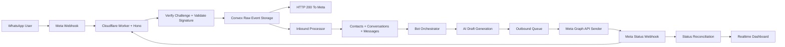

# System Architecture

## Top-Level Runtime

## Core Boundary Decisions

### Ingress Worker

The worker owns:

- GET webhook verification
- POST signature validation using the exact raw body
- Edge rate limiting scoped by `phoneNumberId`
- Durable raw event write to Convex
- Fast `200` response to Meta after storage succeeds

The worker does not own:

- AI generation
- Conversation orchestration
- Outbound sending
- Delivery reconciliation
- Business logic beyond signature, durability, and throttling

### Convex Backend

Convex owns:

- Raw event storage contract
- Dedupe and idempotent processing
- Contact and conversation state
- AI orchestration
- Queueing and retries
- Billing state
- Analytics, notifications, and audit logs

### Web App

The Next.js app owns:

- Marketing pages
- Authenticated dashboard
- Billing webhook endpoint
- Admin and agent workflows

## Runtime Flow

### Inbound Message Flow

1. Meta sends a webhook request to the Hono worker.
2. The worker verifies signature from the untouched raw bytes.
3. The worker rate-limits by `phoneNumberId`.
4. The worker writes the raw event to Convex.
5. The worker returns `200` immediately after durable persistence.
6. Convex deduplicates and normalizes the event.
7. Convex updates contact, conversation, message, and service-window state.
8. Convex schedules media handling if the payload contains media.
9. Convex debounce logic decides whether to trigger AI generation.
10. The orchestrator creates at most one assistant message and one outbound queue row.
11. The sender dispatches the outbound job to Meta.
12. Status webhooks update message and queue state.

### Outbound Message Flow

1. Assistant or agent message is created in Convex.
2. A single queue row is created with idempotency key `${integrationId}:${messageId}`.
3. The sender re-checks service-window eligibility immediately before Meta API send.
4. Retryable errors schedule retry with backoff on the same queue row.
5. Permanent errors mark the job failed and visible in ops surfaces.
6. Meta status webhooks reconcile delivery state back onto transcript rows.

## Deployment Topology

- `apps/web` on Vercel
- `apps/ingress` on Cloudflare Workers
- Convex for backend functions and storage
- Clerk for auth and organizations
- Meta WhatsApp Cloud API for transport
- Polar and Midtrans for billing
- Sentry plus Helicone or Axiom for observability

## Architecture Invariants

- Raw webhook events are durable before downstream work.
- AI is asynchronous and never blocks ingress.
- Queueing is the only outbound send path.
- Transport state and transcript state remain linked but separate.
- Service-window enforcement is backend-controlled.
- Tenant state is isolated at the data-access layer.
